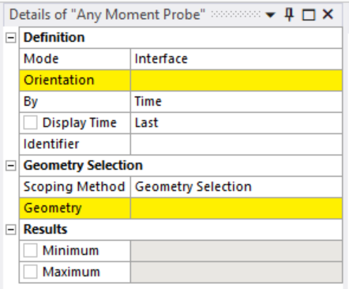
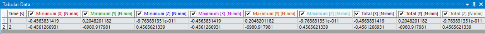
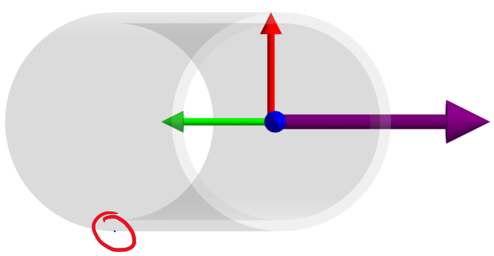
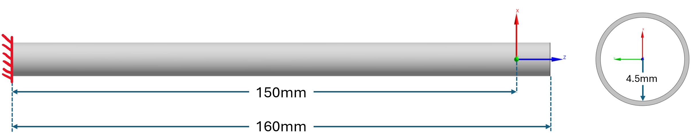
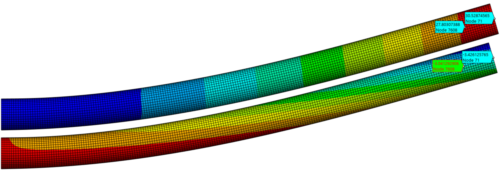
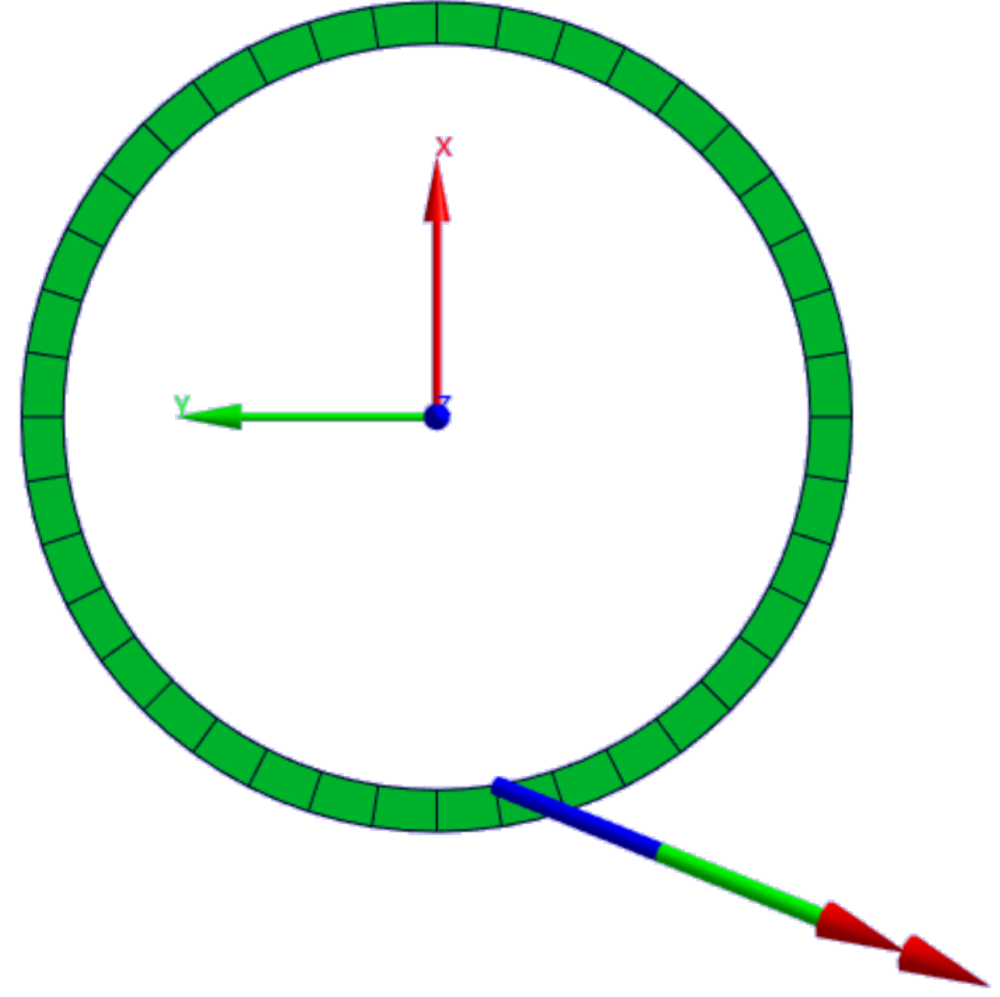

# Extension Manual

[Purpose](#purpose)  
[Instructions for Use](#instructions-for-use)  
[Core Process Outline](#core-process-outline)  
[Example Case](#example-case)

## Purpose
When Large Deflection (NLGEOM) is on, the standard ANSYS Moment Probe will calculate the moment about the undeformed position of the scoped geometry, with the nodal forces at the displaced nodal positions. This means that the resultant moments will have fictitious moment arms and the values incorrect. This installable adds a Tree Object result into the Solution right-click menu, designed to replicate the functionality of the built-in Moment Probe, but with compensation for nodal displacements when Large Deflection is set to “On”. 

**Note**: in 2026R1 Ansys added their own version of this, however fundamental issues exist with the chosen method used.

## Instructions for Use 

Adding the Any Moment Probe to your Tree can be done in two ways:  
1. Large Deflection tab (Ribbon) > Any Moment Probe
2. Right click on Solution (Tree) > Insert > Large Deflection > Any Moment Probe

Once added into the Tree, this result object works similarly to other result objects. In the details menu, select the options you want and then evaluate results as you normally would.

  

**Mode**: This release includes two modes.   
1. Interface: similar to Ansys moment probe Geometry Selection Location Method.
2. Section: similar to Ansys moment probe Surface Location Method. Unlike the Ansys version, no Surface is needed in the Construction Geometry folder. This mode assumes the selected CS Z-Axis is the surface normal.   

**Orientation**: Select CS from dropdown.   
**Geometry**: Depending on selected mode, scope the following:
1. Interface: one or more faces.
2. Section: one body. 

### Result Data and Graphics 
This extension is a Vector Nodal result object (see LDMProbe.xml result definition), meaning that when evaluating results, Mechanical sends nodal data through the collector to be used by the python ACT script. Nodal information is needed in order to obtain node locations and forces required to solve for their contributions to total moment. The collector also expects the data returning to Mechanical to be nodal (i.e. distinct values for each node) to be plotted as a vector map. For this application, however, a map of individual nodal moment vectors would not be useful, and only one (total) value is the desired output. That value is returned only into one node via the collector. This has two minor implications to the user experience. 
#### 1. Data Table   
In a full array of nodal results Ansys normally provides the Min, Max, and Average values of the data for a given time step. Since here only one value is returned, the Min, Max, and Average are all the same. As shown in the table below, the values are identical in each three column groups (X, Y, Z).

  

#### 2. Graphics

As mentioned above, for a Vector Nodal result objects, Ansys expects to plot nodal vectors- something that would not be helpful to the user in this case. However, since only one node receives data back from the python script (and that being the total moment vector), Ansys defaults to displaying that vector at the location of the node to which is assigned. There are two problems with this: first that none of the nodes may be near enough to the scoped CS, and second that the values returned are in the orientation of the scoped CS and Ansys will plot them in Global.  

To get around this issue, and to provide a graphical display that is useful to the users, this extension has functions that are triggered using distinct callbacks:  

- During result evaluation and whenever the result is selected in the Tree:  
  1. In the Result Tab Vector Display section:  
    1.1 Vector display on  
    1.2 Origin (no arrow form)  
    1.3 Sizing scale set to min (left)
  2. Display custom Triad and Vector at desired position/orientation (see [Triad and Vector Display](#triad-and-vector-display)).

- Whenever the result is un-selected:
  1. Clear all custom graphics. 

The result is shown below, the "vector" Ansys wants to display is relegated to a small sphere somewhere on the body and a new triad and vector display appear. Unfortunately, it does not seem that Ansys allows for completely removing the default display objects, so the little ball will always be somewhere (note that since the sphere size is controlled by a sliding scale, it will not be the same size in all cases). 

  

## Core Process Outline
### Interface Mode
1. Nodes collected from scoped Face.  
2. Location of each node is collected and used to determine centroid:  
    2.1 Large Deflection = “On”: uses “LOC_DEF”.  
    2.2 Large Deflection = “Off”, uses initial Node position.  
3. All Elements associated with Nodes are collected.   
4. Element-Nodal reaction loads (“ENFO”) for each Element are collected (F).  
5. For each Node (from nodes collected in [1.]) within each Element, the position vector (r) is determined with respect to the **centroid of the Nodes**:  
    5.1  Large Deflection = “On”: uses “LOC_DEF”.  
    5.2 Large Deflection = “Off”, uses initial Node position.  
6. For each Node* within each Element, a moment (M) is calculated about the displaced centroid by M=rxF. 
7. The total moment is then determined by vector sum of all nodal moments, and rotated to match selected Coordinate System.

*A Node is considered once for every Element (and its internal force reaction) it is associated with, meaning that it might be invoked several times in this step.   

**NOTE**: Orientation coordinate system is not used as the point of moment summation, but only for orientation. This means the selected CS does not have to be located at the target geometry, and that the same CS can be used for any number of probes as long as the desired orientation is common.

**NOTE**: The output data table will include a Maximum, Minimum, and Total columns for each component. These values will all the identical and the Total column should not be confused with a vector sum.  

### Section Mode
This mode follows a similar process to the Interface Mode, except that the nodes used are filtered down in the following manner:
1. Obtain all elements in the scoped body.
2. Define section plane based on scoped CS Z-axis normal.
3. Filter down only elements in section plane.
4. Filter down only element nodes on one side of the section plane (positive Z-axis).

**NOTE**: Orientation coordinate system is not used as the point of moment summation, but only for section location and result orientation.

**NOTE**: The output data table will include a Maximum, Minimum, and Total columns for each component. These values will all the identical and the Total column should not be confused with a vector sum. 

### Triad and Vector Display

The method used here for visually representing the total moment vector is not dynamic (i.e. not tied to mesh deformation scales), and requires a set position to display each time the object is selected in the Tree. The initial solve of the probe stores data (via hidden properties in the Details Menu) that can later be accessed for an on-click callback. In the current release, this data is limited to the moment vector and a size scale (the distance from the nodal centroid to the furthest node). 

The triad and vector are displayed based on the following logic:
- Interface Mode: at the centroid of the face(s) scoped
- Section Mode: at the origin of the selected orientation system.      

There are two notable points to consider: 
1. The triad and vector are not actually positioned on the center about which moments are calculated (nodal centroid).
2. The triad and vector are not displayed in the deformed position from which the moments are calculated when NLGEOM = On.

Both of these points can be subjects of later improvements (e.g. added property dropdowns), as they do not impact the correctness of the results, except maybe in such a case where the desired output moment is not determined on a centroid basis.  

## Example Case

The example discussed here will not elaborate on the original Ansys moment probe (that does not correct for NLGEOM), but on the differences between this extension and the new Ansys moment probe (as of 2026R1) with the NLGEOM correction active. The model presented here is intended as an example of the error that can occur when using the Ansys probe, which is in no way limited to this specific condition. 

### Model Setup and Results

In this model we have a hollow tube fixed at one end and with a force applied at the other (noted reference to the CS shown in the image below). A coordinate system for probing moments is placed 10mm from the end of the tube. Two load cases are considered:  
1. Fz=1000N
2. Fz=Fx=1000N    

  

While for the first load case with only the axial load we will expect no moment in any axis, the second case requires some evaluation by hand calcs. The following two images show the displacement in the X-Axis (top) and Z-Axis at the location of the probe and at the face where the force is being applied.  

  

Knowing that the initial moment arm for the Fx component was 10mm, and 0mm for the Fz, we can calculated the resultant moment for that section:

$$
M = F_x \times (r_z - (dz_{tip} - dz_{section})) - F_z \times (r_x - (dx_{tip} - dx_{section}))
$$ 

and simplifying for Fx=Fz, we get:

$$
M = 1000[N] \times (10 - (3.426125765 - 3.041292906) - (30.52874565 - 27.80307388))[mm] = 6,889[Nmm]
$$ 

Now we can compare these values against the Ansys moment probe and this extension:

| Load Case | Hand Calc | Ansys Probe | This Extension |
|-----------|-----------|-------------|----------------|
|1          |0 [Nmm]    |4,500 [Nmm]  |0.5 [Nmm]       |
|2          |6,889[Nmm] |2,004 [Nmm]  |6,980 [Nmm]     |

### Discussion 

The reason for the error in the Ansys probe is that it calculates the moment about the position (LOCDEF) of the nearest node to the scoped CS, not the CS itself, when NLGEOM=on (as shown below). In the first load step the purely axial load of 1,000 N is calculated at a node on the ID of the tube (r=4.5 mm), resulting in 4,500 Nmm of fictitious moment. This is also true for the second load case, though it is less obvious since the moment is not expected to be 0.    

  

It should be noted that each time this particular model is re-meshed and re-run, the total moment on the second step as measured by the Ansys probe resulted in a different value. This is because the "closet node" among all equidistant nodes on the ID, with respect to the center CS, is randomly assigned, and so the center of moment summation is not constant.

### Conclusion

More generally, it should be observed that the Ansys moment probe will always be incorrect unless there happens to be a mesh node at the exact position of the desired CS. Error will be proportional to the distance to the closest node and the magnitude of load perpendicular to that distance vector.  

**CRITICAL NOTE**: The Ansys moment probe output will not necessarily be higher than the true value, but it will be wrong. Using the Ansys moment probe does NOT guarantee conservatism.